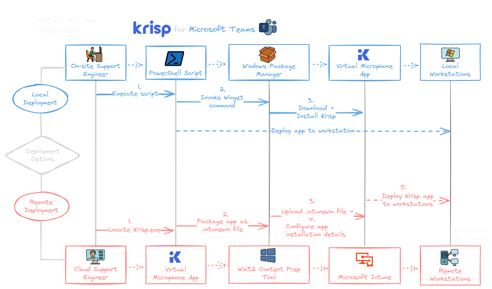
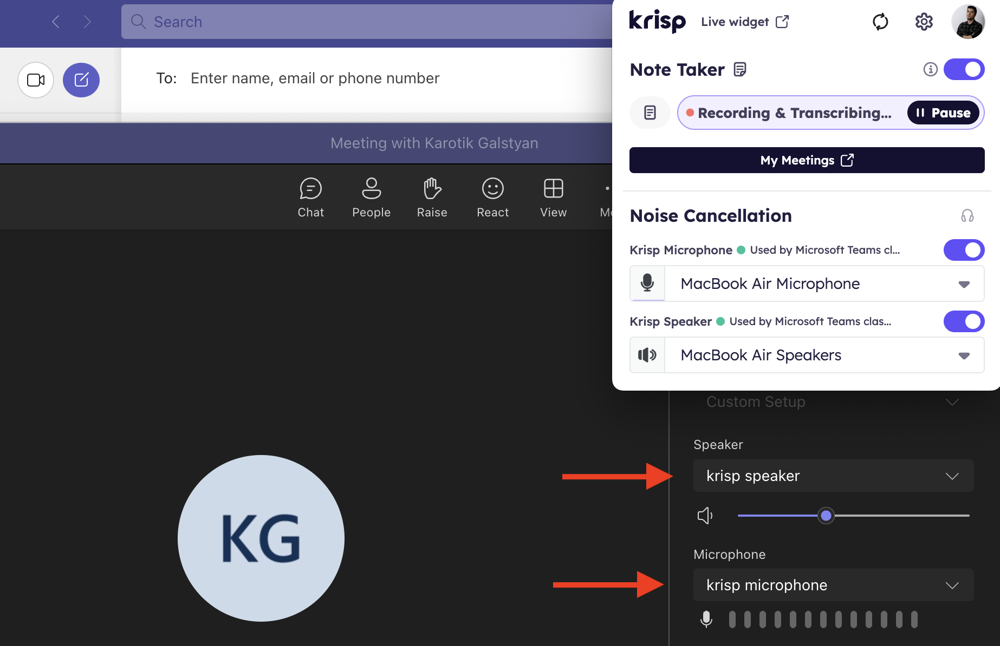
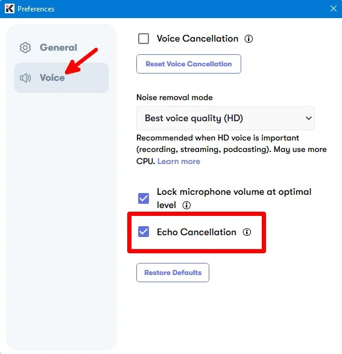
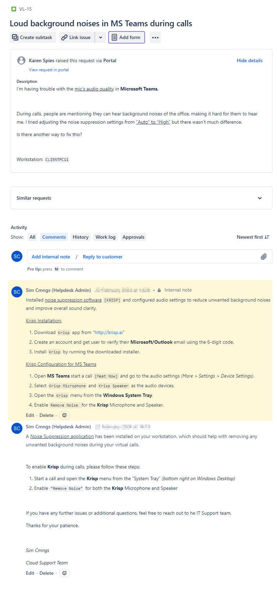

# Deploying a Virtual Microphone Solution - for Microsoft Teams

This project aims to resolve the issue of "disruptive background noises" during virtual meetings and calls, by deploying a Virtual Microphone/Noise Suppression solution that easily integrates with **Microsoft Teams**.



> Originally, this project was made to help a co-student suppress the background noises their microphone was picking up during our Zoom call sessions. 
> 
> This project has been adapted to work within the context of a hypothetical IT Support environment, changing the video/conferencing platform from Zoom to Microsoft Teams, and including deployment options.

## 🛠 Tools & Technologies:

- **System:** `Windows 11`, Windows `Server OS`
- **Cloud Platforms:** `Microsoft 365` / `MS Teams`
- **Device Management:** Microsoft `Intune`
- **Virtualization:** `Hyper-V`
- **Scripting/Automation:** `PowerShell`
- **Software Package Management:** `Winget`
- **Ticketing System:** `Jira` Service Management *(Cloud)*

---

# Introduction

An indie-game development company (VGM-LAB) - are facing a difficult challenge, with a number of their employees unable to have productive virtual **Teams** meetings due to several factors:

**On-Site Colleagues** - <ins>Distracting Background Noises</ins> 

> Conversations and surrounding office equipment are being picked up by remote employees' microphones, due to the site's <ins>open-office layout</ins> and <ins>lack of soundproofing</ins>.

**Remote Employees** - <ins>Voice/Room Echoes</ins>  

> Employees working from poor-acoustic home offices, are experiencing <ins>voice echoes</ins> and <ins>room reverb</ins>, making it difficult for participants to focus and understand each other.

**Remote Clients** - <ins>Poor Audio Clarity</ins> 

> Clients' computer speakers were also experiencing <ins>poor audio quality</ins> during video calls and product demonstrations, making it difficult for them to hear and understand the game developers.

### 🏢 Company Background:
- The client is a small-sized Game Development company, outsourcing the management of their IT services to our Cloud Support Team.
- Their reliance on remote meetings has increased due to more team members working from home, with Microsoft Teams being their primary platform for virtual collaboration.
- Complaints include poor microphone/audio quality and background noises disrupting the flow of virtual calls and meetings.


## ⛔ Problem Statement:
The Support Team was receiving a high volume of tickets related to microphone issues in Microsoft Teams. The problems ranged from:

- ❌ Background Noises - being audible and distracting callers
- ❌ Voice Echoes - causing confusion during client meetings and team discussions
- ❌ Muffled Audio - callers unable to hear speaker clearly


## 💡 Solution:
To address the microphone issues, I deployed a Virtual Microphone and Noise Suppression solution called `Krisp`. Krisp is a cloud-based software that can integrate directly with `Microsoft Teams`. 

Krisp was able to address each of the identified problem statements and offered the following key features:
- ✅ Background Noise Cancellation
  - *(removing disruptive office sounds and background conversations)*
- ✅ Echo Removal
  - *(eliminating voice or room echoes from any environment)* 
- ✅ Enhanced Voice Quality
  - *(improving clarity and volume balance between speaker and caller)*   

---

# 💻 Implementation:

### 1️⃣ Evaluation and Testing:
Created a test environment, using `Hyper-V` virtual machines to mimic the users' Microsoft Teams setup. This included the exact software configurations, hardware specs and room conditions that the end-users would be using.


> #### **Local Users'** <ins>desktop environment</ins> 

<details><summary>VM 1 checklist</summary>

  `On-Prem VM`
  - [x] **OS**: `Windows 11`
  - [x] **Hardware Specs**: CPU: *2 cores* | RAM: *8GB (8192)* | HDD1: *256GB*
  - [x] **Device Management**: local `Active Directory` on `Windows Server OS`
  - [x] **Teams Setup**: `Teams` <ins>(classic)</ins>

</details>

> #### **Remote Users'** <ins>desktop environment</ins>

<details><summary>VM 2 checklist</summary>

  `Cloud VM`
  - [x] **OS**: `Windows 11`
  - [x] **Hardware Specs**: CPU: *2 cores* | RAM: *8GB (8192)* | HDD1: *256GB*
  - [x] **Device Management**: `Microsoft Entra ID` / `Intune`
  - [x] **License**: `Microsoft 365` E5 
  - [x] **Teams Setup**: `Teams` <ins>(new)</ins>

</details>

---

> [!NOTE]
> **Drop-down sections above** (^) - expand for more info.
---
Performed <ins>A/B comparison tests</ins>, to evaluate the noise suppression capabilities of **Krisp** against the default **Microsoft Teams** audio settings.

    TEST SCENARIO 1: Background Noise Cancellation
    
    Introduced various types of background noises, such as office conversations, 
    fan noises, and keyboard typing.
    
    The Krisp-enabled audio, consistently provided a cleaner and more focused sound, 
    eliminating the distracting background noises.
    



    TEST SCENARIO 2: Echo Removal

    Made a test call in an empty room, observing Krisp's ability to reduce the voice echo and 
    room reverberations. 

    The Krisp-enabled audio, consistently provided a clearer and more forward sound, 
    removing the voice echoes completely.
  


---

### 2️⃣ Deployment:
<ins>2 deployment options</ins> were created for installing Krisp, to work for each use-case scenario. 

> OPTION 1: Single User, LOCAL Deployment
> 
> OPTION 2: Multiple Workstations, REMOTE Deployment

#### OPTION 1: Single User, LOCAL Deployment

    For local deployments, I developed a PowerShell script in combination with the 
    Windows Package Manager (Winget) to automate the installation process.

    This allowed for a silent and unattended installation of Krisp, providing a convenient and 
    self-service option for both individual users and on-site engineers.

Installing **Krisp** with <ins>*Windows Package Manager*</ins>: `winget`


`PowerShell` -script

<details><summary>KrispWingetInstall.ps1</summary>

```powershell
# Check if winget is installed
$wingetInstalled = Get-Command winget -ErrorAction SilentlyContinue

# Install winget if it's not installed
if (-not $wingetInstalled) {
    Write-Host "Installing winget..."
    Invoke-WebRequest -Uri "https://github.com/microsoft/winget-cli/releases/latest/download/Microsoft.DesktopAppInstaller_8wekyb3d8bbwe.appxbundle" -OutFile "$env:TEMP\winget.appxbundle"
    Add-AppxPackage -Path "$env:TEMP\winget.appxbundle"
    Write-Host "winget installed successfully."
}

# Install Krisp using winget
Write-Host "Installing Krisp..."
winget install Krisp.Krisp -e
Write-Host "Krisp installed successfully."

```
</details>

---

#### OPTION 2: Multiple Workstations, REMOTE Deployment
    
    For remote deployments, I packaged the Krisp installer into an .intunewin file, 
    uploading to `Microsoft Intune` for an available assignment.

    This allowed for the central management and distribution of Krisp to multiple workstations, 
    providing the flexibility to target specific users or device groups.

Running <ins>Intune Win32 Content Prep Tool</ins> to generate the **.IntuneWin** file:


`PowerShell` -script

<details><summary>IntuneWin32ContentPrep.ps1</summary>

```powershell
# Edit these variables to match your SETUP
$IntuneWinAppUtilFolder = "C:\Intune\3-IntuneWinAppUtil" # REPLACE with Intune Win32 Content Prep Tool location 
$SourceFolder = "C:\Intune\1-Krisp" # REPLACE with app setup file location 
$SetupFile = "Krisp_2.33.5" # REPLACE with name of app setup file
$OutputFolder = "C:\Intune\2-IntuneApps" # REPLACE with folder location to save IntuneWin file

# Change Directory
Set-Location -Path $IntuneWinAppUtilFolder

# Run Intune Win32 Content prep tool with parameters
& "$IntuneWinAppUtilFolder\IntuneWinAppUtil.exe" -c "$SourceFolder" -s "$SourceFolder\$SetupFile.exe" -o "$OutputFolder" -q

```
</details>

---

Both deployment options also helped to <ins>mitigate security risks</ins> associated with manual software installations:

> - <ins>Reduced</ins> the potential for <ins>unauthorized installations</ins>,
>   - *by NOT downloading the Krisp installer to a visible location on the user's device.*
>   
> - Validated the <ins>software's integrity</ins> and <ins>lack of malicious code</ins>,
>   - *by identifying and deploying the latest patched version of Krisp.*
 
---

### 3️⃣ Training and Support:

USERS:

- Created a 2-step instruction <ins>"Ticket Response Template"</ins> that can be used by the Support Team.
- Made for replying to customer support tickets, regarding the integration of Krisp with Microsoft Teams.
> *To train users on activating Krisp*

SUPPORT TEAM:

- Created more detailed <ins>"Manual-Installation Instructions"</ins> on configuring Krisp with Microsoft Teams.
- Added as an internal note to `Jira` support tickets, making them accessible only to authorized support team members.

---

`Jira` -support ticket 

Screenshot - Jira Support Ticket



</details>

---

## 📊 Results:
The deployment of the Virtual Microphone and Noise Suppression software (Krisp) resulted in the following benefits for both users and support team members:
- 🤝 **Improved Meeting Productivity**
>    - (Krisp's noise-cancellation feature, will remove distracting noises during remote meetings, allowing for <ins>more productive conversations</ins> and <ins>improving overall engagement</ins>).
    
- ⏱️ **Faster Resolution Times**
>    - (The 'Ticket Response Template' and 'Manual-Installation Instructions', will provide the Support Team with the necessary guidance to <ins>resolve microphone-related issues on the first call</ins>).
    
- 🔕 **Non-Intrusive Experience**
>    - (The 2 deployment options, will automate the installation process in the background of the user's workstation, <ins>reducing interruptions to their workflow.</ins>).

---

## 🎉 Conclusion:
The users reported a noticeable enhancement in their overall audio experience with MS Teams, with fewer distractions and improved clarity during team meetings and client calls.

---
